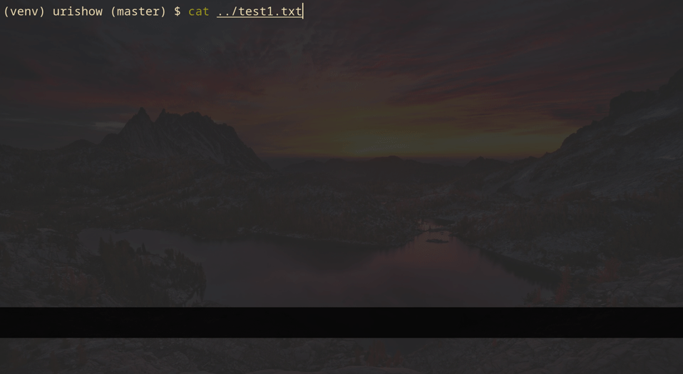

# Urishow
Select a uri from an input stream and open it with the correct program, useful in Mutt.

## Installation
```
$ make
# make install
```

## Usage
```
usage: main.py [-h] [-p] [-r REGEX] [-c COMMAND] [-f FILE]

Extract, show, select and launch uri's.

optional arguments:
  -h, --help  show this help message and exit
  -p          just print the extracted uri's
  -r REGEX    regex for extracting uri's
  -c COMMAND  command to launch uri
  -f FILE     file to extract uri's from
```
